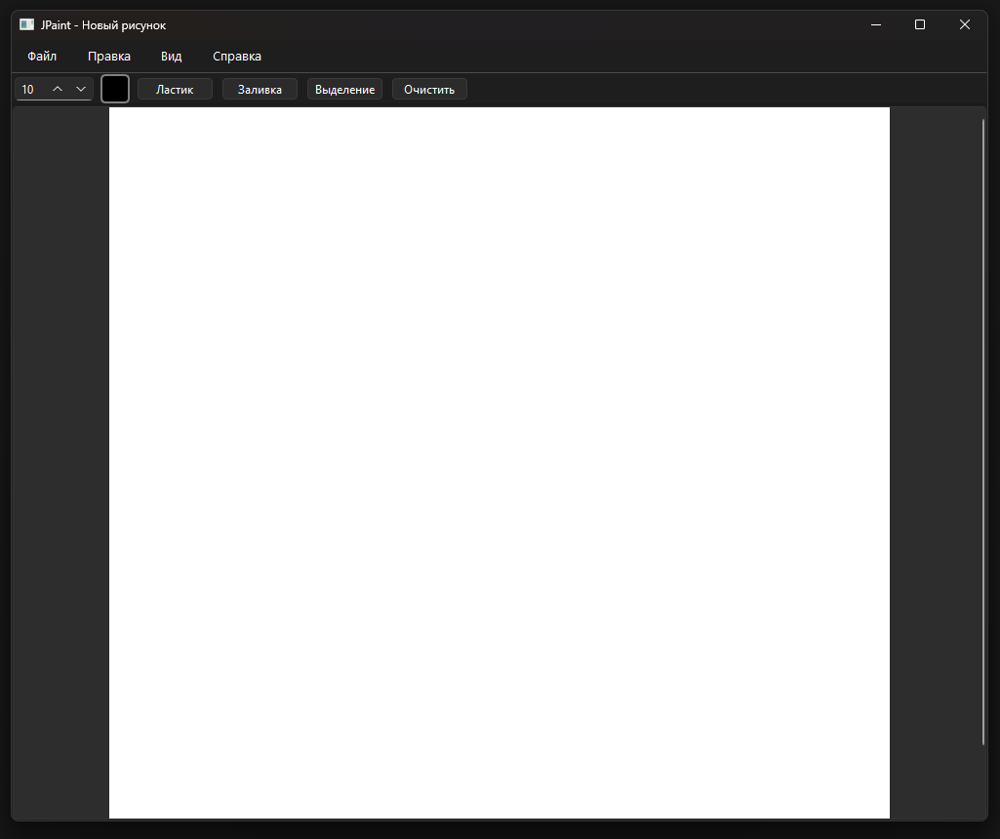
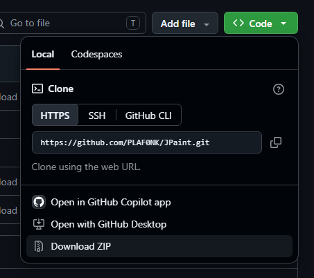
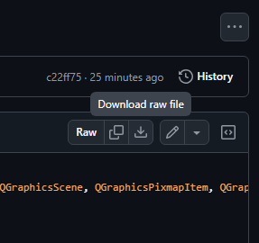

# Переносной графический редактор JPaint

## Описание программы и её работы

### Базовая информация
JPaint - это простой графический редактор, сделанный с упором на переносную архитектуру\
Программа состоит всего из одного файла JPaint.py, который является почти полностью самодостаточным\
Единственными зависимостями JPaint являются только Python и PyQtб - весь функционал редактора реализован только через них\
\
</img>
\
В состав интерфейса JPaint входят:
- Основное пространство рисования -  в нём находится холст изображения. По умолчанию он прикреплён к центру пространства, но с помощью Ctrl+ЛКМ его можно свободно перетаскивать по всей видимой области
- Верхняя панель инструментов - на ней расположены кнопки для переключения состояний кисти/просмотра
- Меню окна - полный набор инструментов и настроек, которые включены в приложение

### Работа с приложением

JPaint функционирует так же, как и большинство других графических редакторов:
- Рисование линии на холсте включается при нажатии ЛКМ
- Корректировать нарисованное можно через инструменты "Ластик" или "Выделение"
- Выделенная область удаляется нажатием клавиши DEL (Delete)
- Размер кисти и ластика регулируется через специальный селектор
- Цвет кисти можно изменить, нажав на квадратную кнопку, показывающую текущий выбранный цвет\
##### Программа по умолчанию открывается с размером окна в 800x800 пикселей. Несмотря на это, размер окна можно изменять как угодно и переводить его в развёрнутый режим

## Установка

### Установить JPaint можно несколькими способами:
#### Способ 1:

1. Сначала нужно скачать репозиторий как Zip-архив и разархивировать его в любое удобное место (желательно в отдельную папку). Скачать репозиторий можно следующим образом:
\
</img>
\
или же, можно скачать только файл JPaint без остальных файлов репозитория:
\
</img>
2. Затем нужно установить Python 3.14 (рекомендуется именно эта версия, также возможна поддержка более старых 3.13 и 3.12, поддержка более новых версий не гарантируется)
3. Установить зависимости, написав команду:
```
pip install PyQt6==6.11.0 PyQt6-Qt6==6.11.1 PyQt6_sip==13.12.0
```
или, если был скачан целый репозиторий:
```
pip install -r requirements.txt
```
4. Приложение полностью готово к запуску (для отладки рекомендуется запускать через "py JPaint.py" или "python3 JPaint.py" в окне командной строки

#### Способ 2:

1. Скачать бинарный файл из списка релизов на странице
2. Переместить в любое удобное место
3. Запустить программу

##### 
**ВНИМАНИЕ!**\
*Хотя данный способ более удобный (из-за того, что бинарные файлы полностью самодостаточны и не нужно устанавливать дополнительные зависимости), он несёт высокие риски: бинарные файлы, скачанные со сторонних источников, никак не контролируются и могут быть несанкционированно модифицированы*

## Использование

JPaint является полностью бесплатной программой и распространяется на условиях лицензии GPL3. Данный редактор можно использовать, модифицировать и распространять на условиях настоящей лицензии\
\
Во избежание проблем с совместимостью, рекомендуется использовать кодовую версию JPaint\
Кодовая версия совместима со всеми версиями Windows, совместимыми с Python 3.14 и PyQt6\
Бинарная версия совместима с Windows 10 21H2 и более поздними версиями
Работа кодовой версии на операционных системах, отличных от Windows, возможна только в том случае, если такая операционная система поддерживает PyQt6 и динамическую линковку библиотек "на лету"
Работа бинарной версии на операционных системах, отличных от Windows, невозможна из-за зависимости от системных вызовов Windows API. Также, не гарантируется стабильная работа этой версии внутри эмуляторов

## Важное предупреждение

Монолитность архитектуры JPaint - это одна из главных особенностей данного редактора, она делает программу переносимой и независимой от места нахождения исполняемого файла\
Модульное разделение в данном репозитории, как и в других монолитных проектах, не планируется


